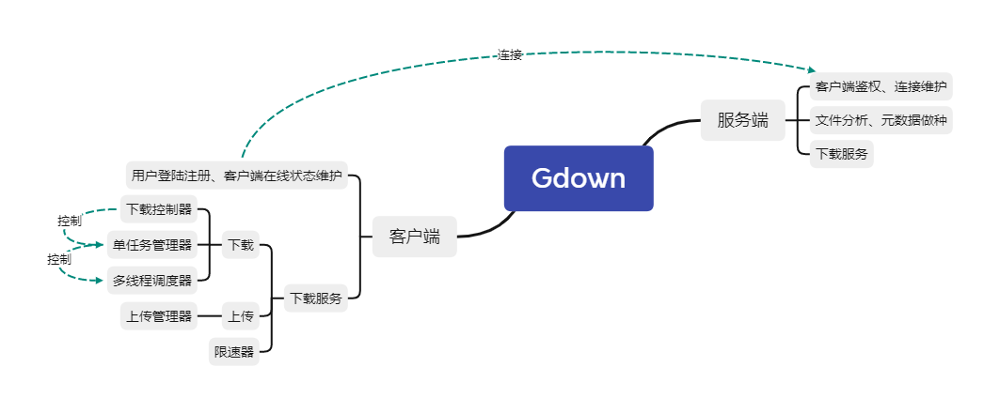
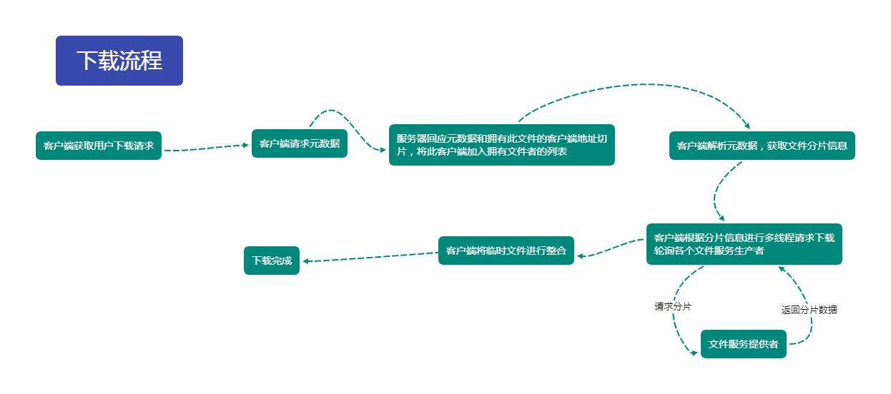

# Gdown

## 快速开始

1. 启动服务端：运行`server.exe`，默认监听端口8080。
2. 填写客户端配置文件`config.toml`。
```toml
# 服务端地址
service_adr=""
# 用户名
username=""
# 密码
Password=""
# 本地监听端口
client_port=
# 下载限速。为0不限速。请填写1024*1024以上的数字。
down_rate=
# 上传限速。同上。
up_rate=
```
3. 启动客户端：运行`client.exe`，默认连接本地8080端口。
4. 客户端登陆。
5. 客户端下载。

## 整体架构

## 下载整体流程
